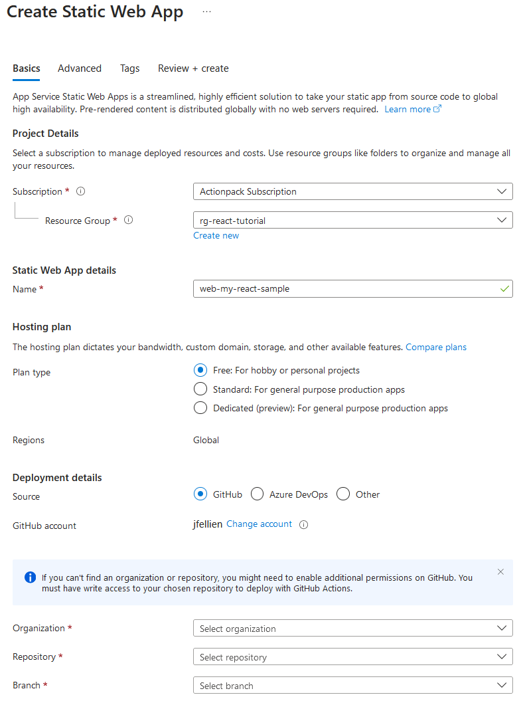
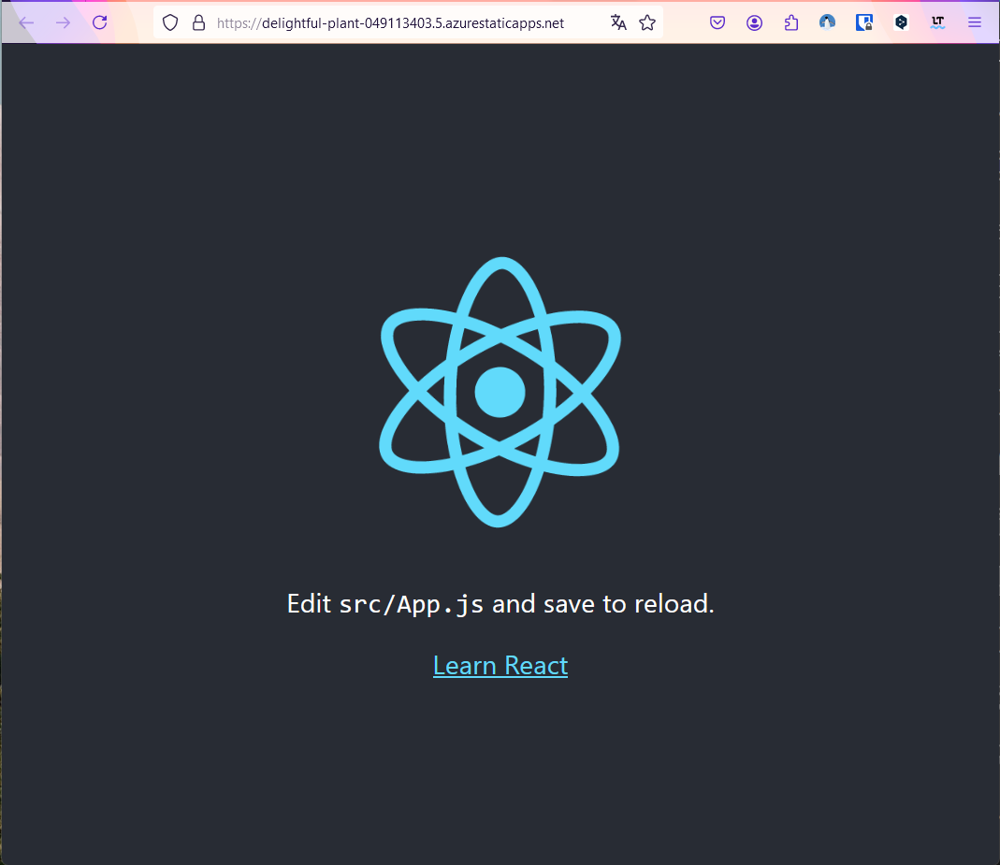

# How to create a react app as Static Web App for Azure

Why is this article necessary instead of just referring to the documentation at Microsoft? Quite simply, when I tried it with the documentation, I unfortunately found that not everything worked as desired.

## Preparation

To develop an Azure Static Web App, it is useful to install the swa-cli. But not only that, there are other preparations to be done. Here is my setup, with which I developed this example:

- Visual Studio Code (VSCode)
- Azure Static Web Apps Extension for Visual Studio Code (SWA Extension)
- NodeJs 18x

Using the SWA Extension, the SWA CLI can be installed. To do this, simply run the command in VSCode:

`> Azure Static Web App: Install or Update Azure Static Web Apps CLI`

## Project Setup

Usually, as Microsoft offers, you can clone a SWA from an existing GitHub repository. However, since it seems that the developers are not interested in maintenance, you would be copying a pretty old version and then doing a lot of post-processing. That's why I want to manually set up the project here.

First, I set up the packages I need for the React app. To do this, I run the following commands in the terminal in the root directory of my project:

`> npx create-react-app my-sample`

It may ask to install `create-react-app` first. You can confirm that.

After a while, the project is set up in the 'my-sample' directory and I can start setting it up as a SWA. To do this, I navigate to the 'my-sample' directory and run the command in the terminal:

`> swa init`

I simply confirm the questions in the console with Enter, because the initial configuration is sufficient for me.

To see the result, I run the command:

`> swa start`

This starts the Static Web App Emulator and allows me to test the web app locally. I can now start and see the generated React app in the browser at the URL 'http://localhost:4280'.

## App Deployment

As the final step of this tutorial, I want to deploy the app to the cloud to complete the example.

There are several ways available for deployment. One option is to directly perform a `swa deploy` from the SWA CLI. That is theoretically good, but not in the spirit of DevOps. Therefore, I will not do that. My approach is not strictly DevOps either, but at least I have an automatic deployment in the end.

The first step is to push the code to a GitHub repository. You can find my code here: [my-sample](https://github.com/jfellien/my-react-app-sample). Now I switch to the [Azure Portal](https://portal.azure.com) and manually set up a Static Web App here. Normally, I would do this using a pipeline and the Bicep Language, but that goes beyond the scope of this tutorial.

In the [Azure Portal](https://portal.azure.com), I set up a resource group and then add a Static Web App here. (I hope you have already created resources in the portal, because I don't want to show these steps here either). I give the SWA resource the name 'web-my-react-sample'. Choose a name that you like :). I use the Free plan type because it is sufficient for this example. For the deployment details, I choose GitHub as the source, but as you can see, other repositories are also supported. In the case of GitHub and Azure DevOps, the portal is able to create the necessary pipeline itself, which is fantastic.
I choose the same account that I used to push the source code. Finally, I select my organization, repository, and branch from which the deployment will be done.

The wizard is now able to determine what type of SWA it is. In my case, all configuration data was set correctly. However, they can still be changed later.

I confirm my details with 'Review + create' and now let the resource be set up. Once the resource is set up, the deployment process begins. A deployment pipeline was automatically created and added to the repository. In this case, using GitHub Actions.

In the overview of my Static Web App, I can either click on 'Visit your site' or the generated URL. And behold, my app is deployed. Fantastic.

