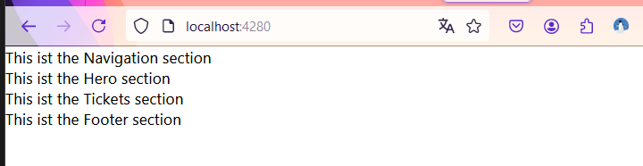

# How to structure a React app

In part 1 of my tutorial, I started lifting a React app as a Single Web Application into the Azure Cloud. This app doesn't have any functionality or design yet. In this part of my tutorial, I will structure my app. Another tutorial will add an API to the app.

## Website structure

I have chosen a classic structure for a website, with a navigation, a hero section, an area where products can be selected, and a footer. The navigation will always be visible, while the other sections can be scrolled.


The navigation allows navigating directly to different sections of the webpage. The hero section displays a welcome message and possibly a claim. The tickets section displays products linked to an ordering system. The footer contains some static information.

I will describe each of these sections in detail.

First, let's examine the structure and derive the initial components.

## React components

React uses components for better structuring and reusability. They are defined as JavaScript functions and allow for custom logic. I see a clear advantage in using components as they allow me to build the website in a clean way.

This construct serves as the basis for all my components. While it's not mandatory to write the code exactly like this, it's the easiest way for me.

```
function MySampleComponent() {
    return (
        <>
            ... add your HTML stuff here ...
        </>
    );
}

export default MySampleComponent;
```

A component always starts with a capital letter. Although this contradicts JavaScript conventions, it's acceptable. You can start the filename with a lowercase letter if you prefer. ;)
The function always returns a piece of HTML, and since React expects JSX (a syntax extension for JavaScript), we wrap the return value in an empty HTML tag (`<>`). JSX ensures that only one HTML tag is returned. The empty tag guarantees that.

To use this component, I reference it in the corresponding file.

`import MySampleComponent from "./components/MySampleComponent"`

And in the code, I use the component like an HTML element.

`<MySampleComponent />`

At this point, the content of my component will be rendered.

## Website development

The entry point for our website is `index.js`. This file sets up the framework for the entire application. It starts by finding the root element of the `index.html` page and then renders all our components inside it. The first component to be rendered here is the `App`. This is where I will add my components and build the website. However, you can also do this directly in `index.js`.

To show quick results, I create the four components of the planned structure in the `components` folder. These are `NavigationBar`, `Hero`, `Tickets`, and `Footer`. All components follow the same pattern. (Note: `NavigationBar` will change later)

```jsx
function Hero() {
  return (
    <>
      <section id="hero">This is the Hero section</section>
    </>
  );
}

export default Hero;
```

Now I replace the template code in `App.js` and add the components.

```jsx
import "./App.css";
import NavigationBar from "./components/NavigationBar";
import Hero from "./components/Hero";
import Tickets from "./components/Tickets";
import Footer from "./components/Footer";

function App() {
  return (
    <>
      <NavigationBar />
      <Hero />
      <Tickets />
      <Footer />
    </>
  );
}

export default App;
```

After starting the SWA Emulator with

`> swa start`

in the application folder, I see the following result in the browser:



With this, the overall structure of the application is created. In future posts, I will continue building this page and adding navigation, an API, and some logic.
