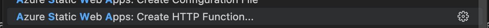

# Adding an API to a React Static Web App

In previous articles, I have described how to build a React app as a Static Web App (SWA) (Part 1, Part 2, Part 3). So far, it has been a simple website that wouldn't make much sense to be provided as a React app. With this post, I want to give the app a purpose and add an API behind it.
To follow along with my explanations, you will need my [GitHub repository](https://github.com/jfellien/my-react-app-sample) for this tutorial.
## Static Web App with an API
In the first part of the tutorial, I set up the development environment for the React app, including the SWA CLI and its extension in VS Code. Now, the extension finally comes into play. Using F1 in VS Code, I invoke the commands and select the command "Azure Static Web App: Create HTTP Function". You may be prompted to install the Azure Functions extension in VS Code, which is a great idea. :)


I name my function "GetTickets". It will fetch all ticket types that can be displayed on the website.


I choose C# as the language because, although I would have preferred to do the tutorial with JavaScript, at the time of writing this blog post, the latest version of Functions and JavaScript in Static Web Apps was not yet functional.


Next, I enter the namespace for my function and then I am prompted to set the access rights.


It should be noted that "Anonymous" is the best choice for access rights. Securing the API will be done at a different level. The other options, "Function" and "Admin", do not make sense in a SWA environment and can be ignored.
The SWA extension completes its work by creating the function. It creates a new folder called 'api' in the root directory of the app and copies the function app into it. For now, I leave all the settings as they were generated.
One thing that bothers me a little about this template is that it still uses .NET version 6, whereas version 8 is much better for Function Apps.
To let my React app know that an API is available, I modify the SWA config and add the property "apiLocation": "/api" in the swa-cli.config.json file. Now, the SWA CLI will check the contents of the folder and build the API accordingly.
To test if everything has gone well so far, I start the app locally with the command:
> swa start

The output now shows a message that a function has been found.


You can open the address http://localhost:7071 in your browser. You will see that there is a function app there. And if you also want to access http://localhost:7071/api/GetTickets, you will see that the function app has been successfully set up and is ready.
## React App with an API
I have made some changes to the generated "GetTickets" function so that it returns two tickets that I will display on the website.
```csharp
public static class GetTickets
{
    [FunctionName(nameof(GetTickets))]
    public static IActionResult Run(
        [HttpTrigger(
            AuthorizationLevel.Anonymous, 
            nameof(HttpMethods.Get), 
            Route = "tickets")] 
        HttpRequest req,
        ILogger log)
    {
        log.LogInformation("C# HTTP trigger function processed a request.");
        List<Ticket> tickets = new () {
            new() {
                Name = "One Day Ticket",
                ValidFor = "one day",
                Price = 100
            },
            new() {
                Name = "Two Day Ticket",
                ValidFor = "two days",
                Price = 200
            }
        };
        
        return new OkObjectResult(tickets);
    }
}
```
To display these tickets on the website, I call the API in my Tickets component as follows:
```javascript
const tickets = await (await fetch(`/api/tickets`)).json();
```
I use the 'tickets' object in the return value of the component by calling
```javascript
{tickets.map(renderTicket)}
```
I have created the `renderTicket` function so that I can convert a list of data into HTML with the same formatting.
Now, when I look at my website, not much has changed. The tickets are displayed correctly, but now they come from the API. Wonderful.
With that, I conclude this tutorial and wish you a lot of fun exploring further possibilities with React.


